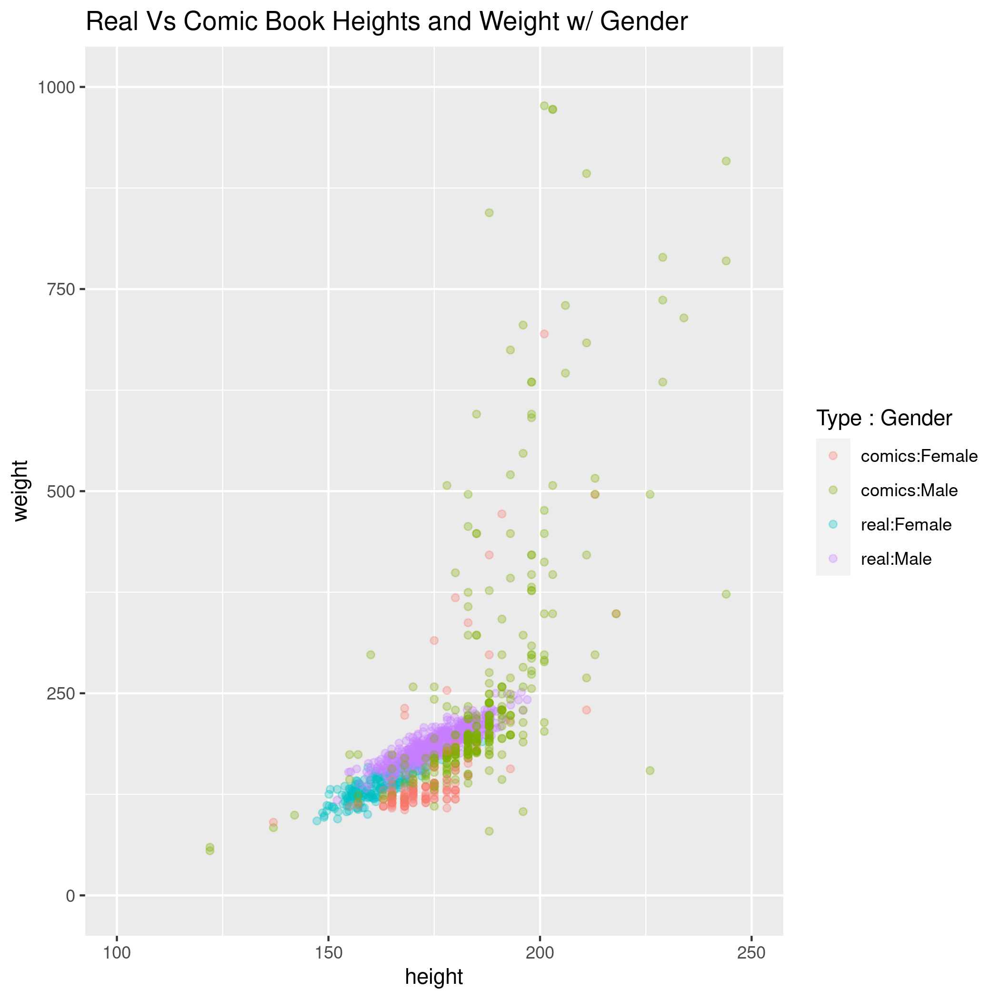
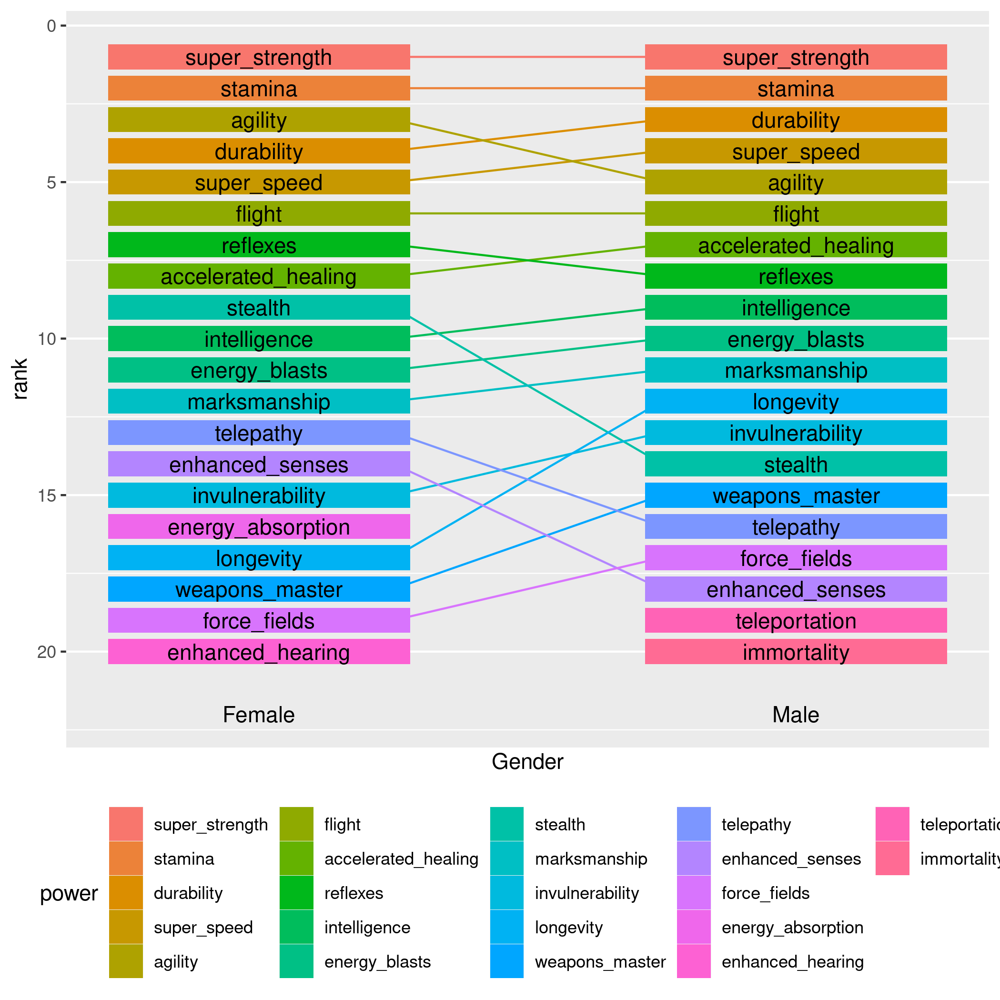

Project 1 Bios 611
==================
Superhero Powers Dataset
------------------------

Proposal
--------

### Introduction

For better or worse, comic book super heroes occupy a central cultural
role. Like most works of non-polemical fiction, and perhaps all the
more true for what one might dismissively call low art, super hero
comics draw on the collective unconscious and thus reflect an
unfiltered view of contemporary cultural mores. 

Can we see biases related to gender in datasets which cover super
heroes, their powers and strengths and weaknesses? In what ways does
gender manifest itself in these fundamentally freeform fictional
characters.

This project will undertake descriptive statistics of several publicly
available data sets. We will also look at naive bayesian models which
try to predict super hero gender on the basis of their super
powers. Finally, we will apply state of the art tree based regression
to the same problem.

On the way we may do some clustering and a little machine learning.

### Datasets

The datasets we undertake to analyze are publicly available on Kaggle
and cover super hero powers and other personal information. They can
be downloaded .

This repo will eventually contain an analysis of
the Superhero Powers Dataset.

### Preliminary Figures

The above figure shows that there is a difference between the way
weights and heights are distributed and related between real and
fictional human beings.

While powers are distributed similarly between male and female heroes,
some notable exceptions exist.

Usage
-----

You'll need Docker and the ability to run Docker as your current user.

You'll need to build the container:

    > docker build . -t project1-env

This Docker container is based on rocker/verse. To run rstudio server:

    > docker run -v `pwd`:/home/rstudio -p 8787:8787\
      -e PASSWORD=mypassword -t project1-env
      
Then connect to the machine on port 8787.

If you are cool and you want to run this on the command line:

    > docker run -v `pwd`:/home/rstudio -e PASSWORD=some_pw -it l6 sudo -H -u rstudio /bin/bash -c "cd ~/; R"
    
Or to run Bash:

    > docker run -v `pwd`:/home/rstudio -e PASSWORD=some_pw -it l6 sudo -H -u rstudio /bin/bash -c "cd ~/; /bin/bash"

Makefile
========

The Makefile is an excellent place to look to get a feel for the project.

To build figures relating to the distribution of super powers over
gender, for example, enter Bash either via the above incantation or
with Rstudio and say:

    > make figures/gender_power_comparison.png 
    
